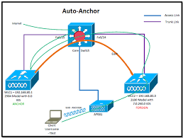

Topic 1.2 and 3.3
# Wireless 

## Terminology
Term|Definition|Other
---|---|---
AD-HOC mode|Two or more wireless clients connecting directly to each other, No Need for an access point (if your computer has a wireless card), Not used very often |
BSS|This is the range of a wireless device and how far it can propagate. |Basic Service Set
IBSS|Ad hoc service connection, This is creating wireless connections with out the use of any other network equipment.   Sometimes also called Peer-to-peer|Independent Basic Service Set
BSA|This is the range of  equipment when using network infrastructure(ie using an access point.) Kind of like the range of an access point.   Might also be called a cell. |Basic Service Area
SSID|Name of a network|Service Set ID
BSSID|MAC Address of an access point| Basic Service Set ID
ESSID|When a Set of access points advertise the same BSA(or advertising the same SSID)| Extended Service Set ID
MBSSID|| Multiple Basic Service Set ID
Intra-controller roaming
Inter-controller roaming
EIRP||Effective Isotropic radiated power
Free space path loss||
H-Plane|This is the horizontal plane on the access point. You can use dBm to calculate this.| Top view of a office layout
E-Plane|This is the vertical plane| this is the side of an office layout.
EIRP|This is the actual power that you can emit. This is regulated based on where you live.| Effective isotropic radiated power
dBm|Tx power as it relates to miliwatts
dBi| antenna gain|
ISM|Industrial Scientific and Medical| used for 2.4 ghz
UNII|Unlicensed National Information Infrastructure | used for 5.0 ghz
MIMO|multiple input multiple output| You would be using multiple antennas
MU-MIMO| Multiple user - multiple input multiple output

## Wireless Standards
Who creates the wireless standards - The IEEE
- 802.11 Wireless LAN standards
Interoperability testing
- WIFI alliance is a 3rd party group that does WIFI testing to make sure companies work together, as expected.
Regulation Organizations - they design power levels, What channels can be used, many other standards.
- FCC - Federal communications commission - United states
- ETSI - European Telecommunications Standards institute
- TELEC - Telecom Engineering Center - Japan
- BRAI - Broadcasting Regulatory Authority of India

### Wireless and Radios
Selecting Wi-Fi channels  
2.4 Ghz 
- Technically there are 14 channels. but 14 is only allowed in Japan. and only works on on 802.11b
- Most common channels are 1, 6, 11
- Channels are 5 MHz apart
- Range of frequency 22 MHz

5.0 Ghz

Standard|Year released|Frequency band|Maximum bandwidth|Transmission Method
---|---|---|---|---|
802.11n|2009| 2.4 and 5|150 Mbps|OFDM
802.11ac|2014|5|3.5 Gbps|OFDM
802.11ax|2019|2.4 and 5|9.6 Gbps|OFDMA

## Wireless communication Theory

           |  Cycle  |     Frequency = 2 Hertz
           ^         ^
          / \       / \
         /   \     /   \
     ---/-----\ --/-----\ ------
               \ /       \ / 
                V         V
        |    1 second       |

Frequency = Number of complete cycles per second. 
Cycle = One complete up and down motion  
Hertz = Measurement of cycles
Attenuation = The power in the wave lessens and lessens as the wave goes farther out. 
Radio Frequency (RF) Range:
- Between 3 kilohertz (Khz) and 300 Gighertz (gHz)
- Wireless communication found within this range
    - 2.4 GHz band = 2.4 2.4835 GHz
    - 5 GHz band = 5.15 to 5.85 GHz
- Wireless band subdivided into channels
Wave length is how wide a wave is. The higher the frequency the shorter the wave. Generally a lower frequency signal will travel further.  
The Amplitude is the height of the wave. The more power you push the higher the wave.  

Wireless is half-duplex

RF Signal Strength:
- Measured in decibel milliwatts (dBm)
- Transmitters range between 1 and 100 milliwatts
- Milliwatt (mW) = 1/1000 of a watt
- 10 db would mean that you received the power at 10 times the power that was originally sent out.
- 0 db means that you received the signal at the same power that it was sent out at.
- -10db means that you received the power at 1/10 the power that was originally sent out at.

mW|dBm
-|-
1 mW|0 dBm
10 mW|10 dBm
100 mW|20 dBm
1000 mW|30 dBm

The scale for db and wattage is not linear 
how the math works out.
Rule of 10s and 3s:
- Gain of 10 dBm = mW power is multiplied by 10
- Loss of 10 dBm =  mW power is divided by 10
- Gain of 3 dBm = mW power is doubled
- Loss of 3 dBm = mW power is halved

power|db
-|-
10|10x
3|2x
0|same
-3|1/2
-10|1/10

Received Signal Strength Indicator (RSSI):
- Closer to zero value means a strong signal
- the reason its negative is because the farther away you get from the access point the less milliwatts you are receiving. meaning the less dBms you are receiving.
- -30 is very good, -90 is not useable, -50 is the sweet spot, -70 works but not well for 
- 0 no connectivity. 255 is great
- Sensitivity level
  -  Need to learn more

Some things that can affect RF signals:
- Path loss and scattering. This happens as you move further and further away.
- Lead (and other obstacles absorbing the RF)
- Mirror (reflections, multi-path, fade)
  - if a signal is out of phase by 180 degrees that is very bad, and your wireless will be hard to use. This is called downphase
  - if you receive two signals and the are perfectly in phase, that is a good thing and its called upphase.
- Long range atmosphere refraction. This is more of a WAN issue.
- Noise (interference with the RF)

SNR:
RSSI (Signal you want) minus Noise (interference) = Signal to noise ratio (SNR)
- Difference in decibels between signal and background noise.
- The background noise is called the Noise floor. This is the interference that is happening all the time that is interfering with those same signals.
- SNR of 20 or higher is desirable.

Tx power(dBm) + Antenna Gain (dBi) - Cable loss = EIRP

## Wireless Lan Design
### What are the different roaming types?
Roaming
- When a wireless client changes it access point association
- For roaming to work the WLCs must agree to use the capwap,  the same mobility group name, use the same virual ip, same vlan configuration and they must be running compatible software.
Intra-controller roaming
- Roaming between access points which are connected to the same wireless lan controller
Inter-controller roaming
- Roaming between access points which are connected to the different wireless LAN controllers 
Layer two roaming
- This is two different controllers that are serving different access points
- But both of these controllers are on the same vlan/subnet
- I keep my same ip address
- My user should not notice
Layer three roaming
- This is two different controllers that are serving different access points
- This time the two controllers and access points are on different vlans/subnets
- Client will not need to a new ip address
  - What happens is the two wireless controller will form a CAPWAP tunnel with each other and sends that clients data
  - The original controller is called the Anchor controller. This one houses my data
  - The controller that i am passing through is call the foreign controller
Anchor controller
- Mobility anchor is different than a typical anchor. It will be the leader of a mobility group. IT will handle all the of the control and management traffic.
Foreign controller  
  
Mobility group
  - This is where you have groups of controllers that can take and for CAPWAP tunnels with other
  - But you cannot have two WLC that are in different mobility groups form CAPWAP tunnels
  - This will cause a outage for your client
  - Static ip address can be assigned to a user. you will need to use a feature called static ip tunneling. for this to work the WLC must be in the same mobility group.

# This one needs to be updated
### Wireless deployment options
Centralized  
Distributed  
Controller-less  
Controller based  
Cloud  
Remote Branch  

Ad Hoc Wireless lan
- Two or more wireless clients connecting directly to each other
- no need for an access point
- Not used very often  

Mesh Wireless Lan
- Wireless access points that connect to each other with Wireless
- no need for a wired connection for the access point to work
- Service will drop the more access points you add  

# Access Points

## AP type, Ap Mode and antenna type

### AP Type
Autonomous Access Points
- Standalone, independent devices
- Home or small office environments
- Each access point is controlled independent
- No knowledge of other access points in the network
- Configured individually without a centralized controller
- Not commonly used in large enterprise networks

Lightweight access point 
- Requires central wireless LAN controller (WLC)
- Controller-based deployment model
- WLCs can be physical or virtual
- Controller communications changes to the aps
- Control and provisioning of wireless access points (CAPWAP)
- Propagate an SSID throughout a large area

## Access point Operation
- The access point will first boot an operating system
- Then the ap will discovery a WLC. The goal is to discover as many WLC's as possible.
  1. AP sends out a broadcast message to find out if WLC is on the same network
  2. local stored WLC management ip address sorted (This would not happen with a brand new AP, or if you log in and assign WLC address)
  3. DHCP option 43 information used
  4. DNS discovery - CISCO-CAPWAP-CONTROLLER.localdomain
  5. no controller found, LAP will reboot and try again
- Establish an CAPWAP tunnel
- AP will Join the WLC
  - WLC selection process
    1. Join a previously know controller
    2. Join a master controller
    3. Join the least-loaded controller
- Image download check
- Config download state
- Now operating mode

### Ap Mode
Local mode
- Default operating mode for LAPs
- Provides SSID and wireless
- When not actively in use, LAP will preform background operations

Monitor mode
- LAP only performs background operations
- No network access provided to users
- Monitoring on IDS event, rogue AP, location-based services, ect  

FlexConnect
- Allows for management of LAPs at a remote location
- Controlled over a WAN connection
- Data is dropped off at the site instead of the capwap tunnel

Sniffer Mode
- LAP acts as a packet capture device
- Dedicated to receiving wireless traffic
- Traffic forwarded to a traffic analyzer system for analysis  

Rogue Detector mode
- LAP is dedicated to the discovery of rouge decies
- checks the mac addresses of clients against known addresses
- Helps to prevent mac spoofing and similar attacks

Bridge mode
- LAP is used to bridge together separate sites as a mesh bridge
- point-to-point
- point-to-multipoint

Flex+bridge
- Combines FlexConnect and Bridge mode function
- Mesh network that can be controlled remotely

SE-Connect mode 
- LAP operates as a spectrum analyzer devices
- Gathers information about all channels
- Forwards information to a spectrum analysis tool
- Cisco spectrum expert

### Antenna Type
Omnidirectional
- Donut shaped wireless single
- Lower gain, with less focused path
- Better for broad coverage
Directional
- Designed to propagate in a specific direction
- Higher gain, with a very focused path
- Better for specifically directing coverage
- Types
  - Patch
  - Yagi
  - Dish 

## WLAN Troubleshooting
When troubleshooting Wireless, there are three devices you may need to check.
- WLC
- Access point
- Client 
Sucessful client WLAN association
 - Client must be within the AP RF range
 - Client must properly authenticate to the WLAN
 - Client should receive a valid ip address on the subnet
Some errors you make see. May need to google for the real world. check the status code on client tab
Some WLAN disrupter
- WiMax
- Zigbee
- Bluetooth
- Gaming controllers
- Phones
- Monitors
- Lights
- Microwave ovens
You can use mping to test out the management path, and eping to test the data path.
Some commands to use on the WLC
- Show run-config commands
- Show arp switch
- eping (ip_address)
- mping (ip_address)
- show ap summary
- show ap join status summary all
- several different debug commands
- show client summary
There is a setting on the cisco wlc that can tell you the amount clean air and the aqi. This will tell you if there is a lot of noise in the area of an access point. 100 means very clean. 1 means not clean at all.
wIPS is wireless intrusive prevention system

## Wireless Security
Extensible Authentication Protocol (EAP)
802.1x Authentication:
- IEEE Standard which defines port-based network control
- uses EAP over LAN (EAPoL) to control access to the local area network
- EAP can only use RADIUS
Different key styles
- Symmetrical - same key
- asymmetrical - key pair. Different keys on both sides.

WLAN security
- WEP - PSK
- WPA - TKIP and optionally AES
- 802.11i/WPA2 - (AES/CCMP - Counter cypher mode protocol)

Enterprise generally means that you are using a radius server.
personal generally means that you are using a PSK

PMK is a Pairwise master key (session key). the AP and the client have both of these keys. and that is how the user authenticates with the ap after the initial authentication. Not very secure.  unless you have the four way handshake and create a PTK (pairwise transit key).

Three device roles for EAP
1. Supplicant: The endpoint requesting access (Laptop)
2. Authenticator: Network device controlling phyical access to the network (WLC or the Access Point)
3. Authentication server: Performs the actual authentication of the endpoint (ISE)

Supplicant | Authenticator | Authentication server
| EAPoL Start >> | |
|<< EAP-Request/Idenitiy| | 
|EAP-Response/Idenity >> | RADIUS access-request >> |
|<< EAP-Request| << Radius Access-Challenge | 
|EAP-Response >>| RADIUS access-request >> | 
|<< EAP-Seccess| << Radius Access-accept|

EAP Types
- Notes
  - Both tunnel types use TLS tunnel as the outer method and EAP type as an inner method

- Native EAP Types
  - LEAP (Lightweight EAP)
    - There is no digital certs to set up. There will be mutual authentication between the users device and the auth server.
    - Generally easier to set up.
  - EAP-TLS
    - One of the most secure EAP types
    - Uses x.509 certificates for Mutual authentication
    - Highly regarded in BYOD deployments
    - digital certs needed to operate.
  - EAP-MD5
    - Hides credentials in a hash
    - Common on IP phones
  - EAP-MSCHAPv2
    - Credential encrypted within a MSCHAPv2 session
    - Simple transmission of credentials
    - Ability to communicate with Active Directory
  - EAP-GTC
    - Cisco alternative to MSCHAPv2
    - Enables more generic authentication
-  Tunneled EAP Types
  - PEAP (Protected EAP)
    - Originally proposed by Microsoft
    - Uses X.509 certificate
    - Uses an additional native EAP type for the inner method
    - digital certs needed to operate.
  - EAP-FAST (Flexible authentication via Secure Tunnel)
    - Created by Cisco as a PEAP alternative
    - Faster re-authentication
    - Faster wireless roaming
    - Uses protected access credentials (PACs)
    - No digital certs need to be created.

### WLAN frame types
Wlans use CSMA/CA. This is different than wired networks.  
A client will send a frame to the access point called a request-to-send(RTS) to see if the client can transmit. If the client receives a clear-to-send (CTS) then the client knows that it can send data.  
Frame Types
- Management frames - Beacons (These tell the client about what SSIDs are available.), probes (This is a active scan from the client), association, authentication
- Control frames - RTS, CTS, ACK
- Data - Payload  
NAV = Network allocation vector - Amount of time required on the WLAN. When the NAV reaches 0 we can send traffic.
SIFS = Short inter-frame space

### Rogue access points
Your access points can find rouge access points. You can set up your access to to join the channel and send deauth requests on that channel.

You can classify a access point as friendly, unclassified, custom or malicious.  
we can have a set of rules that can automatically classify a device.