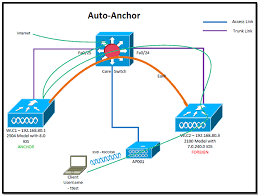

Topic 1.2 and 3.3
# Wireless 

## Wireless Lan Design
### What are the different roaming types?
Roaming
- When a wireless client changes it access point association
Intra-controller roaming
- Roaming between access points which are connected to the same wireless lan controller
Inter-controller roaming
- Roaming between access points which are connected to the different wireless LAN controllers 
Layer two roaming
- This is two different controllers that are serving different access points
- But both of these controllers are on the same vlan/subnet
- I keep my same ip address
- My user should not notice
Layer three roaming
- This is two different controllers that are serving different access points
- This time the two controllers and access points are on different vlans/subnets
- Client will not need to a new ip address
  - What happens is the two wireless controller will form a CAPWAP tunnel with each other and sends that clients data
  - The original controller is called the Anchor controller. This one houses my data
  - The controller that i am passing through is call the foreign controller
Anchor controller
Foreign controller  

 Mobility group
  - This is where you have groups of controllers that can take and for CAPWAP tunnels with other
  - But you cannot have two WLC that are in different mobility groups form CAPWAP tunnels
  - This will cause a outage for your client

# This one needs to be updated
### Wireless deployment options
Centralized  
Distributed  
Controller-less  
Controller based  
Cloud  
Remote Branch  

Ad Hoc Wireless lan
- Two wireless clients connecting directly to each other
- no need for an access point
- Not used very often  

Mesh Wireless Lan
- Wireless access points that connect to each other with Wireless
- no need for a wired connection for the access point to work
- Service will drop the more access points you add  

## AP type, Ap Mode and antenna type

### AP Type
Autonomous Access Points
- Standalone, independent devices
- Home or small office environments
- Each access point is controlled independent
- No knowledge of other access points in the network
- Configured individually without a centralized controller
- Not commonly used in large enterprise networks

Lightweight access point 
- Requires central wireless LAN controller (WLC)
- Controller-based deployment model
- WLCs can be physical or virtual
- Controller communications changes to the aps
- Control and provisioning of wireless access points (CAPWAP)
- Propagate an SSID throughout a large area

## Access point Operation
- The access point will first boot an operating system
- Then the ap will discovery a WLC. The goal is to discover as many WLC's as possible.
  1. AP sends out a broadcast message to find out if WLC is on the same network
  2. local stored WLC management ip address sorted (This would not happen with a brand new AP, or if you log in and assign WLC address)
  3. DHCP option 43 information used
  4. DNS discovery - CISCO-CAPWAP-CONTROLLER.localdomain
  5. no controller found, LAP will reboot and try again
- Establish an CAPWAP tunnel
- AP will Join the WLC
  - WLC selection process
    1. Join a previously know controller
    2. Join a master controller
    3. Join the least-loaded controller
- Image download check
- Config download state
- Now operating mode

### Ap Mode
Local mode
- Default operating mode for LAPs
- Provides SSID and wireless
- When not actively in use, LAP will preform background operations

Monitor mode
- LAP only performs background operations
- No network access provided to users
- Monitoring on IDS event, rogue AP, location-based services, ect  

FlexConnect
- Allows for management of LAPs at a remote location
- Controlled over a WAN connection
- Data is dropped off at the site instead of the capwap tunnel

Sniffer Mode
- LAP acts as a packet capture device
- Dedicated to receiving wireless traffic
- Traffic forwarded to a traffic analyzer system for analysis  

Rogue Detector mode
- LAP is dedicated to the discovery of rouge decies
- checks the mac addresses of clients against known addresses
- Helps to prevent mac spoofing and similar attacks

Bridge mode
- LAP is used to bridge together separate sites as a mesh bridge
- point-to-point
- point-to-multipoint

Flex+bridge
- Combines FlexConnect and Bridge mode function
- Mesh network that can be controlled remotely

SE-Connect mode 
- LAP operates as a spectrum analyzer devices
- Gathers information about all channels
- Forwards information to a spectrum analysis tool
- Cisco spectrum expert

### Antenna Type
Omnidirectional
- Donut shaped wireless single
- Lower gain, with less focused path
- Better for broad coverage
Directional
- Designed to propagate in a specific direction
- Higher gain, with a very focused path
- Better for specifically directing coverage
- Types
  - Patch
  - Yagi
  - Dish 

### Wireless and Radios
Selecting Wi-Fi channels  
2.4 Ghz 
- Technically there are 14 channels. but 14 is only allowed in Japan. and only works on on 802.11b
- Most common channels are 1, 6, 11
- Channels are 5 MHz apart
- Range of frequency 22 MHz

5.0 Ghz

Standard|Year released|Frequency band|Maximum bandwidth|Transmission Method
---|---|---|---|---|
802.11n|2009| 2.4 and 5|150 Mbps|OFDM
802.11ac|2014|5|3.5 Gbps|OFDM
802.11ax|2019|2.4 and 5|9.6 Gbps|OFDMA

## Wireless communication Theory

           |  Cycle  |     Frequency = 2 Hertz
           ^         ^
          / \       / \
         /   \     /   \
     ---/-----\ --/-----\ ------
               \ /       \ / 
                V         V
        |    1 second       |

Frequency = Number of complete cycles per second  
Cycle = One complete up and down motion  
Hertz = Measurement of cycles
Radio Frequency (RF) Range:
- Between 3 kilohertz (Khz) and 300 Gighertz (gHz)
- Wireless communication found within this range
    - 2.4 GHz band = 2.4 2.4835 GHz
    - 5 GHz band = 5.15 to 5.85 GHz
- Wireless band subdivided into channels

RF Signal Strength:
- Measured in decibel milliwatts (dBm)
- Transmitters range between 1 and 100 milliwatts
- Milliwatt (mW) = 1/1000 of a watt

mW|dBm
-|-
1 mW|0 dBm
10 mW|10 dBm
100 mW|20 dBm
1000 mW|30 dBm

Rule of 10s and 3s:
- Gain of 10 dBm = mW power is multiplied by 10
- Loss of 10 dBm =  mW power is divided by 10
- Gain of 3 dBm = mW power is doubled
- Loss of 3 dBm = mW power is halved

Received Signal Strength Indicator (RSSI):
- Closer to zero value means a strong signal
- the reason its negative is because the farther away you get from the access point the less milliwatts you are receiving. meaning the less dBms you are receiving.
- -30 is very good, -90 is not useable, -50 is the sweet spot, -70 works but not well for 
- 0 no connectivity. 255 is great
- Sensitivity level
  -  Need to learn more

#### Need to understand better
Signal to noise ratio (SNR) 
- Difference in decibels between signal and background noise.
- The background noise is called the Noise floor

## WLAN Troubleshooting
Sucessful client WLAN association
 - Client must be within the AP RF range
 - Client must properly authenticate to the WLAN
 - Client should receive a valid ip address on the subnet
Some errors you make see. May need to google for the real world. check the status code on client tab

## Wireless Security
Extensible Authentication Protocol (EAP)
802.1x Authentication:
- IEEE Standard which defines port-based network control
- uses EAP over LAN (EAPoL) to control access to the local area network
- EAP can only use RADIUS

Three device roles for EAP
1. Supplicant: The endpoint requesting access (Laptop)
2. Authenticator: Network device controlling phyical access to the network (WLC)
3. Authentication server: Performs the actual authentication of the endpoint (ISE)

Supplicant | Authenticator | Authentication server
| EAPoL Start >> | |
|<< EAP-Request/Idenitiy| | 
|EAP-Response/Idenity >> | RADIUS access-request >> |
|<< EAP-Request| << Radius Access-Challenge | 
|EAP-Response >>| RADIUS access-request >> | 
|<< EAP-Seccess| << Radius Access-accept|

EAP Types
- Native EAP Types
  - EAP-TLS
    - One of the most secure EAP types
    - Uses x.509 certificates for Mutual authentication
    - Highly regarded in BYOD deployments
  - EAP-MD5
    - Hides credentials in a hash
    - Common on IP phones
  - EAP-MSCHAPv2
    - Credential encrypted within a MSCHAPv2 session
    - Simple transmission of credentials
    - Ability to communicate with Active Directory
  -  

## Terminology
Term|Definition|Other
---|---|---
IBSS|Ad hoc service connection|Independent Basic Service Set
SSID|Name of a network|Service Set ID
BSSID|MAC Address of an access point| Basic Service Set ID
ESSID|A collection of all BSSs (Same as SSID| Extended Service Set ID
MBSSID|| Multiple Basic Service Set ID
Intra-controller roaming
Inter-controller roaming
EIRP||Effective Isotropic radiated power
Free space path loss||
